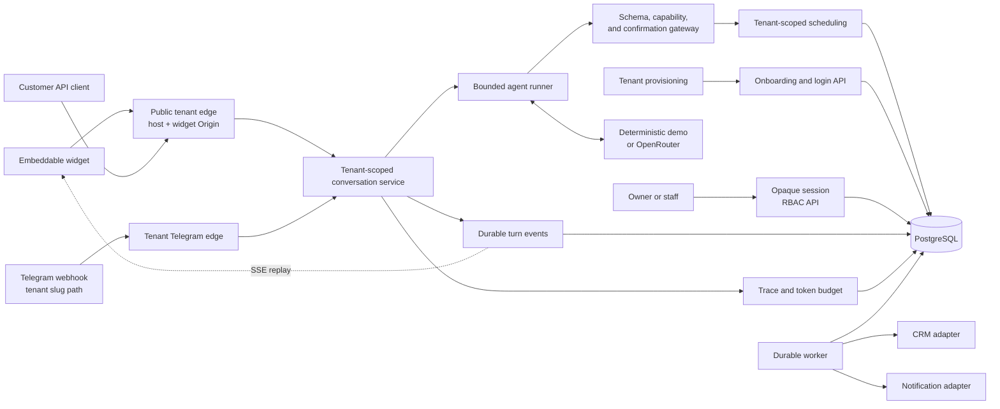

# Kontor

> **A self-hosted AI front desk for appointment-based businesses.**
>
> Kontor turns customer messages into safely confirmed appointments: it checks real availability, asks for explicit consent before changing a schedule, completes the booking, and leaves an audit trail a person can inspect.

Customers should not have to wait for opening hours, change channels, or repeat their details just to make an appointment. Kontor gives service businesses a front desk that can answer around the clock while keeping the critical decisions under server and database control—not in the model prompt.

## What Kontor does

| Capability | How it helps |
| --- | --- |
| **Safe scheduling** | Finds slots across services, staff, working hours, breaks, buffers, busy periods, and IANA time zones—including DST changes. |
| **Explicit confirmation** | Shows the exact appointment before creating, rescheduling, or cancelling it. A model cannot silently mutate the calendar. |
| **Customer channels** | Offers an embeddable browser widget with durable SSE updates and a Telegram webhook, both powered by the same booking core. |
| **Operator workspace** | Provides a live dashboard, run history, nested agent traces, and a weekly calendar with create, reschedule, and cancel actions. |
| **Reliable follow-up** | Queues CRM and reminder work transactionally with a confirmed booking, then processes it through a retrying worker. |
| **Inspectable AI** | Persists conversations, model iterations, tool calls, retries, token usage, escalations, and failures for review. |

## A booking in practice

A customer writes: *“Can I get a haircut on Thursday evening?”* Kontor checks the catalogue, eligible staff, opening hours, breaks, existing bookings, and time zone rules. It offers only real openings. When the customer selects a slot, Kontor presents the exact appointment and waits for an unambiguous confirmation before it writes anything to the schedule.

The same guardrails apply when an appointment is moved or cancelled. Once a booking is confirmed, durable jobs can update CRM records and send reminders without risking a lost side effect.

## Screens


*One timeline for the customer conversation, the agent's reasoning steps, tool calls, retries, and outcomes.*

<table>
  <tr>
    <td width="50%"></td>
    <td width="50%"></td>
  </tr>
  <tr>
    <td><em>Customer chat — a human-readable confirmation separates choosing a slot from creating a booking.</em></td>
    <td><em>Operator dashboard — booking outcomes and agent health in one place.</em></td>
  </tr>
  <tr>
    <td colspan="2"></td>
  </tr>
  <tr>
    <td colspan="2"><em>Weekly calendar — operators can inspect and manage real appointments.</em></td>
  </tr>
</table>

The images are static exports from [`design/screens`](design/screens). The application serves an authenticated operator console at `/operator` and an embeddable customer widget from the same API binary.

## Why it is safe

Kontor treats an LLM as an untrusted planner, not as the owner of customer identity or scheduling authority.

- **Propose, then act.** A mutation starts as a saved proposal. Only a later customer confirmation authorizes its frozen arguments.
- **Server-side authorization.** Every customer conversation receives an opaque, scoped capability token; only its SHA-256 digest is stored. Model-supplied identity data never controls a booking.
- **Database-enforced consistency.** PostgreSQL serializable transactions, schedule locks, idempotency keys, and an exclusion constraint are the final protection against double bookings.
- **Bounded autonomy.** The agent has strict limits for iterations, execution time, retries, and a persisted per-conversation token budget. Failure becomes a safe escalation rather than an unbounded loop.
- **Durable delivery.** Committed customer turns are stored before SSE delivery, so reconnecting widgets can resume from `Last-Event-ID` without gaps or phantom outcomes.
- **Human hand-off.** A customer can request a person, and controlled failures or repeated clarification needs produce a persisted escalation for follow-up.

## Quick start

**Goal:** start the repeatable local demo and make a tenant-scoped customer request. You need Docker with Compose. The default configuration uses a deterministic local model adapter, so an LLM API key is not required.

```sh
git clone https://github.com/reinh2/kontor.git
cd kontor
docker compose up --build
```

When startup completes:

- Open the browser widget at [http://salon-nord.localhost:8080/widget/v1/demo](http://salon-nord.localhost:8080/widget/v1/demo). The tenant is selected from the `salon-nord.localhost` host, not from a request parameter.
- Check API health at [http://localhost:8080/healthz](http://localhost:8080/healthz); `/readyz` additionally verifies PostgreSQL readiness.
- Use the demo conversation API under `/api/v1/demo` on the tenant host. Creating a conversation returns its `capability_token` once; supply it as `Authorization: Bearer <capability_token>` for subsequent messages, events, and traces.

### Tenant provisioning, operator identity, and channels

Stage 6 provisions a complete tenant atomically through `POST /api/v1/tenants`. The request must contain tenant identity (`slug`, `name`, `timezone`, `currency`), an owner account, at least one service and staff member with availability, and a canonical root `channels.widget_origin`. Telegram is optional; when enabled, both Telegram channel values are required. A successful response is `201 Created` with tenant metadata and never includes Telegram credentials. Invalid or incomplete input is `400`, a duplicate tenant is `409`, and there is no provisioning idempotency key: a retry after an indeterminate outcome may return `409` if the original request committed.

Operators sign in with `POST /api/v1/operator/login` using `tenant_slug`, `email`, and `password`. A successful `200` returns a one-time opaque `access_token`, `token_type: Bearer`, `expires_at`, and tenant/operator session facts. Invalid credentials return `401`; each successful login creates a session and is not idempotent. The server stores only a token digest and derives the tenant from the session for protected calls.

Owner-only APIs are `GET`/`PUT /api/v1/operator/channels`, `POST /api/v1/operator/operators`, `POST /api/v1/operator/catalog/services`, `POST /api/v1/operator/staff`, and `POST /api/v1/operator/staff/{staffID}/availability`. They require `Authorization: Bearer <access_token>`; a missing or invalid session is `401` and a staff session is `403`. The tenant comes from the session, so a request body cannot select another tenant. Logout is `POST /api/v1/operator/logout`; it returns `204` after revoking the submitted bearer session.

Public widget and conversation routes resolve the tenant from the first label of `<tenant-slug>.<TENANT_HOST_SUFFIX>`. An unknown host returns `404`. Browser requests must match the tenant's configured widget origin; a mismatch returns `403` before conversation data is read. Operator, onboarding, and widget routes have separate HTTP edges, so widget CORS does not apply to operator or provisioning APIs.

A configured Telegram tenant receives updates at `POST /webhooks/v1/telegram/{tenantSlug}`. The path slug resolves the tenant; the body, chat ID, and headers cannot choose a different one. The webhook validates the tenant's configured secret and returns `404` for an unknown, disabled, or invalidly authenticated tenant. Updates are deduplicated per tenant and update ID; a duplicate returns `200`. A tenant-runtime or persistence failure returns `500` before the update is claimed, allowing Telegram to retry. Bot tokens are encrypted at rest, webhook secrets are stored as digests, and channel read responses do not expose either value.

### Configuration for deployment owners

| Setting | Required/default | Consequence |
| --- | --- | --- |
| `MULTI_TENANT` | Defaults to `true`; `false` is rejected. | Stage 6 always uses tenant boundaries. |
| `TENANT_HOST_SUFFIX` | Defaults to `localhost`; must be a valid DNS suffix. | It defines the public tenant host form. A host outside the suffix cannot resolve a tenant. |
| `TENANT_CHANNEL_ENCRYPTION_KEY` | Exactly 32 bytes. A demo-only default exists only in demo mode; non-demo deployments must provide it. | Startup fails without a valid key; enabled Telegram bot tokens are encrypted with it. |
| `OPERATOR_SESSION_TTL` | Defaults to `12h`; accepted range is 5 minutes to 30 days. | Expired or revoked sessions cannot access protected operator routes. |
| Tenant `channels.widget_origin` | Required at provisioning and canonicalized to an HTTP(S) root origin. | It is the tenant-specific browser CORS allow-list. |

### One-time legacy tenant adoption

This runbook is for deployment owners adopting a tenant that existed before Stage 6. It is **non-demo only** and is not a general owner-reset mechanism.

1. Confirm the target is the intended legacy tenant and has no existing Stage 6 channel or operator configuration. Adoption is atomic for the target tenant only.
2. Enable the path with `STAGE6_BOOTSTRAP_ENABLED=true` and provide all required variables. Do not place their values in documentation or source control:
   - `STAGE6_BOOTSTRAP_ENABLED`
   - `STAGE6_BOOTSTRAP_TENANT_ID`
   - `STAGE6_BOOTSTRAP_TENANT_SLUG`
   - `STAGE6_BOOTSTRAP_WIDGET_ORIGIN`
   - `STAGE6_BOOTSTRAP_OWNER_EMAIL`
   - `STAGE6_BOOTSTRAP_OWNER_DISPLAY_NAME`
   - `STAGE6_BOOTSTRAP_OWNER_PASSWORD`
3. Start the API after migrations. A successful run logs `legacy Stage 6 tenant bootstrap completed` with the target tenant ID and whether a write was applied. An exact replay is a no-write success.
4. Remove **all** `STAGE6_BOOTSTRAP_*` variables immediately after success and restart normally.

The bootstrap is rejected when `DEMO_MODE=true`, when it is not enabled but fields are present, or when any required field is missing. It fails closed for a configured tenant and does not mutate that tenant. There is no default-owner auto-repair or documented reverse operation; on failure, inspect the startup error and tenant state, correct the configuration, and retry only the same intended adoption.

### Optional integrations

- **OpenAI:** copy [`.env.example`](.env.example), set `LLM_PROVIDER=openai`, `OPENAI_API_KEY`, and `OPENAI_MODEL`, then restart Compose. The direct Chat Completions adapter supports the same tool calling, confirmation, authorization, budget, and scheduling rules. OpenRouter remains available with `LLM_PROVIDER=openrouter`.
- **Operator console:** open [http://localhost:8080/operator](http://localhost:8080/operator), then use the tenant-local owner or staff session created through provisioning and login. The Stage 5 shared administrator token is not used by Stage 6.
- **Telegram:** configure a tenant's channel through the owner-only channel API, then register its tenant-specific webhook path. There is no process-wide Telegram bot or webhook-secret configuration for tenant traffic.

## Architecture



The runtime is written in Go and uses PostgreSQL as the source of truth. Stage 6 creates tenant, owner, catalogue, staff, availability, and channel data in one transaction; server-held sessions and host/session/webhook-slug resolution bind later requests to that tenant. A bounded agent loop works with either a deterministic demonstration adapter or OpenRouter's Chat Completions API. The system exposes an allowlisted JSON Schema tool gateway and keeps business authority in server code and database transactions.

## Current scope

Kontor currently includes the capabilities developed across stages 1–6:

- Tenant provisioning, tenant-local owner and staff accounts, opaque operator sessions, and owner-only configuration, catalogue, staff, and availability mutations.
- Public tenant isolation by host and widget origin, plus tenant-scoped Telegram webhooks and credentials.
- End-to-end appointment creation, rescheduling, cancellation, idempotency, and booking-event audit history.
- An embedded widget, durable SSE, CORS and rate-limit protection, a live operator workspace, and persisted agent traces.
- Transactional outbox jobs for reminders and CRM updates, a retrying worker, a log-backed notifier, and CRM adapters including an optional HubSpot integration.

It remains a **demonstration project, not a production booking service**. In particular:

- The fixed `Salon Nord` configuration seeds the repeatable demo; public traffic is tenant-resolved at runtime and Stage 6 has no shared administrator token.
- External calendar synchronization is currently a no-op; PostgreSQL is the appointment source of truth.
- The default model is deterministic and local. OpenRouter is available, but selecting and operating a production model requires real-world evaluation and cost controls.
- Production readiness—multi-instance operation, observability, backup and restore, privacy/data-retention processes, security hardening, load testing, and production deployment—is still planned work.

See the [Russian roadmap](ROADMAP_RU.md), [English roadmap](ROADMAP.md), [product scope](docs/product.md), and [architecture](docs/architecture.md) for the current documented scope and design.

## Development

```sh
make test
make test-race
TEST_DATABASE_URL='postgres://…' make test-integration
```

The default suite covers scheduling, confirmations, bounded agent behavior, token accounting, tools, channels, traces, and operator APIs. PostgreSQL-backed integration tests run when `TEST_DATABASE_URL` is set.

## Licence

No licence file has been added to this repository. Until the owner chooses one, the source is not offered under an open-source licence and normal copyright restrictions apply.
