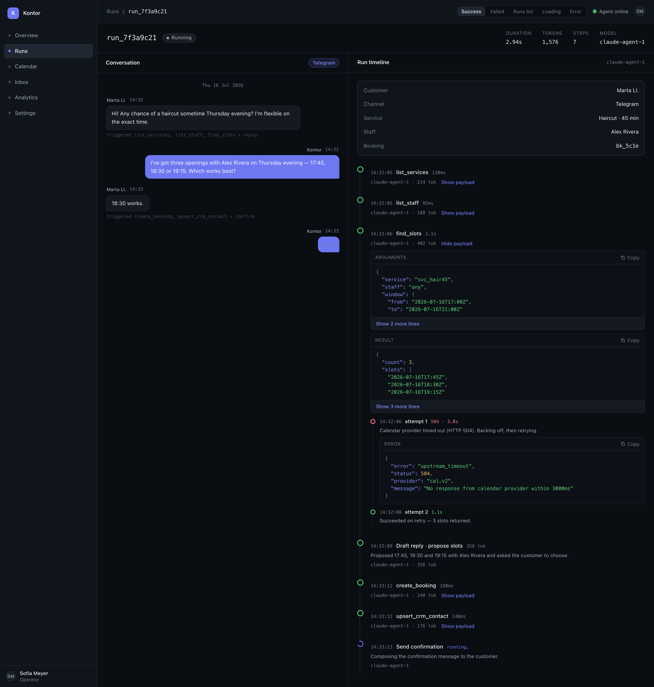
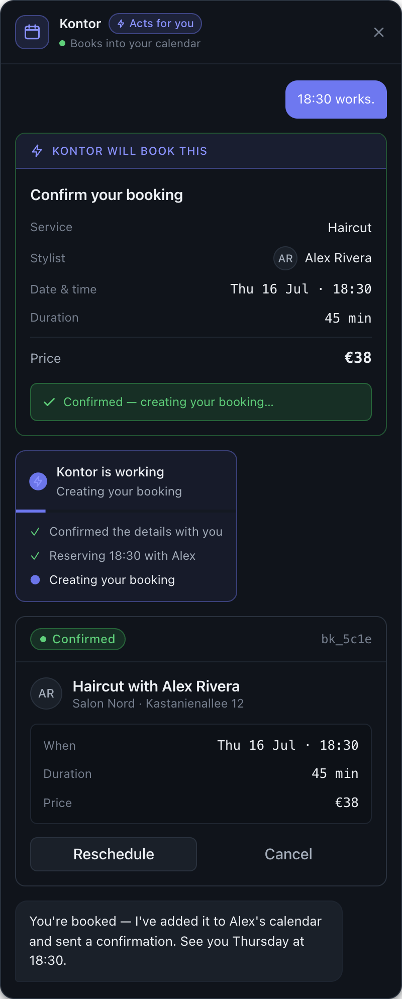
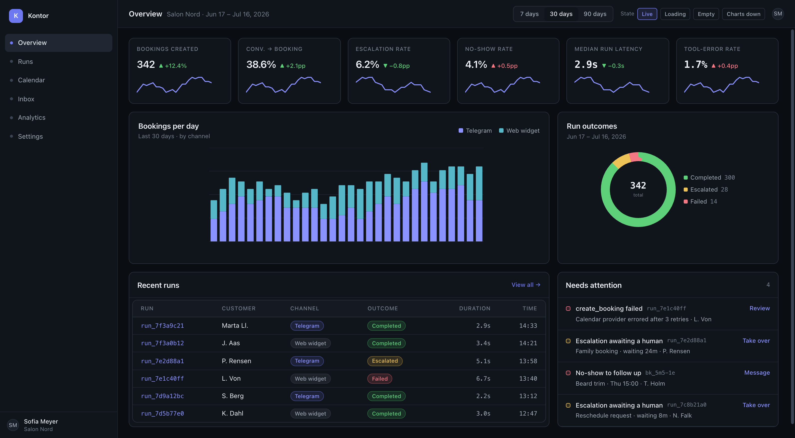
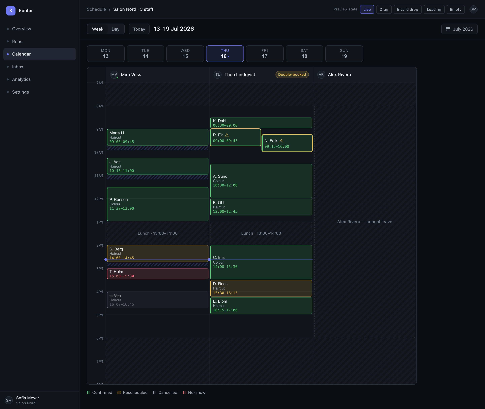
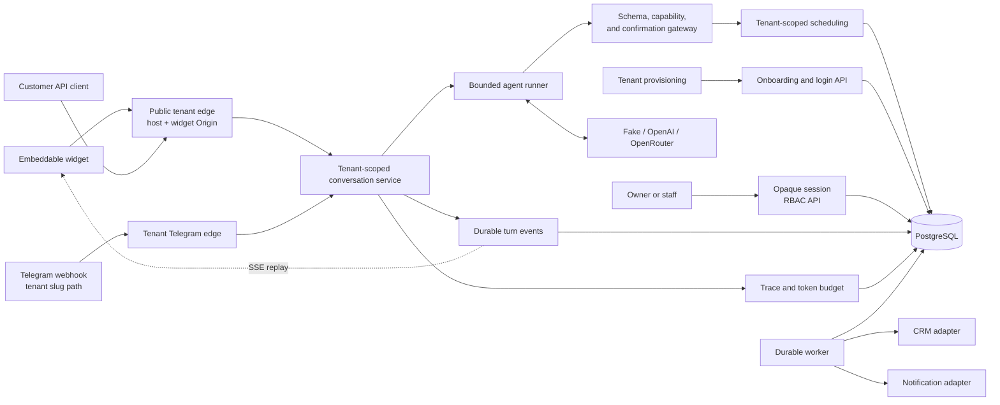

# Kontor

[](https://github.com/reinh2/Kontor/actions/workflows/ci.yml)
[](go.mod)
[](compose.yaml)
[](LICENSE)

**A self-hosted AI front desk that books appointments — without ever letting the model touch the calendar on its own.**

A customer writes *“Can I get a haircut Thursday evening?”*. Kontor checks the real catalogue, staff, opening hours, breaks, buffers and time zones, offers only genuine openings, shows the exact appointment, waits for an explicit *yes*, and only then writes to the schedule. Every model decision is persisted and inspectable.



*One timeline: the customer conversation, the agent's iterations, tool calls, retries, token usage, and outcome.*

## Try it in 30 seconds

No LLM API key needed — the default configuration uses a deterministic local model adapter.

```sh
git clone https://github.com/reinh2/Kontor.git
cd Kontor
docker compose up --build
```

Then open the widget at **<http://salon-nord.localhost:8080/widget/v1/demo>** and the operator console at **<http://localhost:8080/operator>**.

## Why it is interesting

Most “AI agent” demos let the model call a mutating API directly and hope the prompt holds. Kontor treats the LLM as an **untrusted planner** and keeps every consequential decision in server code and database transactions.

- **Propose, then act.** A mutation starts as a saved server-side proposal. Only a later customer confirmation authorizes it — and the server executes its own frozen arguments, not whatever the model re-sends. Tampering after consent is impossible by construction, not detected after the fact. ([ADR-001](docs/decisions.md), [ADR-015](docs/decisions.md))
- **Authority never comes from the model.** Each conversation gets an opaque capability token; only its SHA-256 digest is stored. Model-supplied identity data cannot select a customer or a booking.
- **The database is the last line of defence.** Serializable transactions, schedule locks, idempotency keys, and an exclusion constraint — not application-level checks — are what actually prevent a double booking.
- **Bounded autonomy.** Strict per-turn limits on iterations, wall clock, retries, and a persisted per-conversation token budget. Exhaustion produces a safe escalation to a human, never an unbounded loop.
- **Nothing reaches the customer unchecked.** Free assistant prose is discarded; every customer-facing sentence must pass the validated `respond_to_customer` control call. ([ADR-013](docs/decisions.md))
- **Durable delivery.** A committed turn is stored before SSE delivery, so a reconnecting widget replays from `Last-Event-ID` with no gaps and no phantom outcomes.

## More screens

<table>
  <tr>
    <td width="50%"></td>
    <td width="50%"></td>
  </tr>
  <tr>
    <td><em>Customer chat — a human-readable confirmation separates choosing a slot from creating a booking.</em></td>
    <td><em>Operator dashboard — booking outcomes and agent health in one place.</em></td>
  </tr>
  <tr>
    <td colspan="2"></td>
  </tr>
  <tr>
    <td colspan="2"><em>Weekly calendar — operators inspect and manage real appointments.</em></td>
  </tr>
</table>

The images are static exports from [`design/screens`](design/screens). The application serves the authenticated operator console at `/operator` and the embeddable customer widget from the same API binary.

## Architecture at a glance



| | |
| --- | --- |
| **Language / runtime** | Go 1.25 — two binaries (`cmd/api`, `cmd/worker`) |
| **Dependencies** | Two: `jackc/pgx/v5` and `santhosh-tekuri/jsonschema/v6`. Everything else is stdlib. |
| **Storage** | PostgreSQL 15 — domain data, SSE events, job queue, traces, and budgets. No Redis, no broker. |
| **Frontend** | Vanilla JS widget + operator SPA, embedded with `go:embed`. No npm, no webpack, no build step. |
| **Model providers** | Deterministic fake (default), OpenAI, OpenRouter |
| **CI** | `go vet`, `golangci-lint`, `go test -race`, Docker builds, authenticated Compose smoke test |

Deeper reading: [architecture](docs/architecture.md) · [architecture decision log](docs/decisions.md) · [product scope](docs/product.md) · [coding standards](docs/coding-standards.md) · [current status](docs/current-status.md) · [roadmap (EN)](ROADMAP.md) · [roadmap (RU)](ROADMAP_RU.md)

## Capabilities

| Capability | How it helps |
| --- | --- |
| **Safe scheduling** | Finds slots across services, staff, working hours, breaks, buffers, busy periods, and IANA time zones — including DST transitions in both directions. |
| **Explicit confirmation** | Shows the exact appointment before creating, rescheduling, or cancelling it. A model cannot silently mutate the calendar. |
| **Customer channels** | Embeddable browser widget with durable SSE, plus a Telegram webhook — both on the same booking core. |
| **Operator workspace** | Live dashboard, run history, nested agent traces, and a weekly calendar with create, reschedule, and cancel actions. |
| **Reliable follow-up** | CRM and reminder work is queued transactionally with the confirmed booking, then processed by a retrying worker. |
| **Multi-tenancy** | Atomic tenant provisioning, host-based tenant resolution, per-tenant widget origins, encrypted channel secrets, owner/staff RBAC. |
| **Inspectable AI** | Persists conversations, model iterations, tool calls, retries, token usage, escalations, and failures. |

## Development

```sh
make test         # unit tests, no database required
make test-race    # what CI runs
TEST_DATABASE_URL='postgres://…' make test-integration
```

The default suite covers the availability engine (including DST edge cases), confirmations, bounded agent behavior, token accounting, the tool gateway, channels, traces, and operator APIs. PostgreSQL-backed integration tests run when `TEST_DATABASE_URL` is set.

<details>
<summary><strong>Tenant provisioning, operator identity, and channels</strong></summary>

Stage 6 provisions a complete tenant atomically through `POST /api/v1/tenants`. The request must contain tenant identity (`slug`, `name`, `timezone`, `currency`), an owner account, at least one service and staff member with availability, and a canonical root `channels.widget_origin`. Telegram is optional; when enabled, both Telegram channel values are required. A successful response is `201 Created` with tenant metadata and never includes Telegram credentials. Invalid or incomplete input is `400`, a duplicate tenant is `409`, and there is no provisioning idempotency key: a retry after an indeterminate outcome may return `409` if the original request committed.

Operators sign in with `POST /api/v1/operator/login` using `tenant_slug`, `email`, and `password`. A successful `200` returns a one-time opaque `access_token`, `token_type: Bearer`, `expires_at`, and tenant/operator session facts. Invalid credentials return `401`; each successful login creates a session and is not idempotent. The server stores only a token digest and derives the tenant from the session for protected calls.

Owner-only APIs are `GET`/`PUT /api/v1/operator/channels`, `POST /api/v1/operator/operators`, `POST /api/v1/operator/catalog/services`, `POST /api/v1/operator/staff`, and `POST /api/v1/operator/staff/{staffID}/availability`. They require `Authorization: Bearer <access_token>`; a missing or invalid session is `401` and a staff session is `403`. The tenant comes from the session, so a request body cannot select another tenant. Logout is `POST /api/v1/operator/logout`; it returns `204` after revoking the submitted bearer session.

Public widget and conversation routes resolve the tenant from the first label of `<tenant-slug>.<TENANT_HOST_SUFFIX>`. An unknown host returns `404`. Browser requests must match the tenant's configured widget origin; a mismatch returns `403` before conversation data is read. Operator, onboarding, and widget routes have separate HTTP edges, so widget CORS does not apply to operator or provisioning APIs.

A configured Telegram tenant receives updates at `POST /webhooks/v1/telegram/{tenantSlug}`. The path slug resolves the tenant; the body, chat ID, and headers cannot choose a different one. The webhook validates the tenant's configured secret and returns `404` for an unknown, disabled, or invalidly authenticated tenant. Updates are deduplicated per tenant and update ID; a duplicate returns `200`. A tenant-runtime or persistence failure returns `500` before the update is claimed, allowing Telegram to retry. Bot tokens are encrypted at rest, webhook secrets are stored as digests, and channel read responses do not expose either value.

</details>

<details>
<summary><strong>Configuration for deployment owners</strong></summary>

| Setting | Required/default | Consequence |
| --- | --- | --- |
| `MULTI_TENANT` | Defaults to `true`; `false` is rejected. | Stage 6 always uses tenant boundaries. |
| `TENANT_HOST_SUFFIX` | Defaults to `localhost`; must be a valid DNS suffix. | It defines the public tenant host form. A host outside the suffix cannot resolve a tenant. |
| `TENANT_CHANNEL_ENCRYPTION_KEY` | Exactly 32 bytes. A demo-only default exists only in demo mode; non-demo deployments must provide it. | Startup fails without a valid key; enabled Telegram bot tokens are encrypted with it. |
| `OPERATOR_SESSION_TTL` | Defaults to `12h`; accepted range is 5 minutes to 30 days. | Expired or revoked sessions cannot access protected operator routes. |
| Tenant `channels.widget_origin` | Required at provisioning and canonicalized to an HTTP(S) root origin. | It is the tenant-specific browser CORS allow-list. |

The full set of recognized variables is documented in [`.env.example`](.env.example).

</details>

<details>
<summary><strong>Optional integrations (OpenAI, OpenRouter, Telegram, HubSpot)</strong></summary>

- **OpenAI:** copy [`.env.example`](.env.example), set `LLM_PROVIDER=openai`, `OPENAI_API_KEY`, and `OPENAI_MODEL`, then restart Compose. The direct Chat Completions adapter supports the same tool calling, confirmation, authorization, budget, and scheduling rules.
- **OpenRouter:** set `LLM_PROVIDER=openrouter` with `OPENROUTER_API_KEY` and `OPENROUTER_MODEL`. The wire format additionally sanitizes tool schemas for providers (such as Google Gemini) that reject some JSON Schema keywords; server-side validation still enforces the full Draft 2020-12 schema.
- **Model selection:** measured results per model — including which ones actually complete a booking and at what token cost — are recorded in [`docs/current-status.md`](docs/current-status.md).
- **Operator console:** open <http://localhost:8080/operator>, then use the tenant-local owner or staff session created through provisioning and login.
- **Telegram:** configure a tenant's channel through the owner-only channel API, then register its tenant-specific webhook path. There is no process-wide Telegram bot or webhook-secret configuration for tenant traffic.
- **HubSpot CRM:** available behind a feature flag; the default is a log-backed adapter.

</details>

<details>
<summary><strong>One-time legacy tenant adoption (deployment owners)</strong></summary>

This runbook is for deployment owners adopting a tenant that existed before Stage 6. It is **non-demo only** and is not a general owner-reset mechanism.

1. Confirm the target is the intended legacy tenant and has no existing Stage 6 channel or operator configuration. Adoption is atomic for the target tenant only.
2. Enable the path with `STAGE6_BOOTSTRAP_ENABLED=true` and provide all required variables. Do not place their values in documentation or source control:
   - `STAGE6_BOOTSTRAP_ENABLED`
   - `STAGE6_BOOTSTRAP_TENANT_ID`
   - `STAGE6_BOOTSTRAP_TENANT_SLUG`
   - `STAGE6_BOOTSTRAP_WIDGET_ORIGIN`
   - `STAGE6_BOOTSTRAP_OWNER_EMAIL`
   - `STAGE6_BOOTSTRAP_OWNER_DISPLAY_NAME`
   - `STAGE6_BOOTSTRAP_OWNER_PASSWORD`
3. Start the API after migrations. A successful run logs `legacy Stage 6 tenant bootstrap completed` with the target tenant ID and whether a write was applied. An exact replay is a no-write success.
4. Remove **all** `STAGE6_BOOTSTRAP_*` variables immediately after success and restart normally.

The bootstrap is rejected when `DEMO_MODE=true`, when it is not enabled but fields are present, or when any required field is missing. It fails closed for a configured tenant and does not mutate that tenant. There is no default-owner auto-repair or documented reverse operation; on failure, inspect the startup error and tenant state, correct the configuration, and retry only the same intended adoption.

</details>

## Project status

Kontor is a **demonstration and portfolio project, not a production booking service.** Stages 1–6 are complete (booking core, channels, design implementation, reminders/CRM, operator console, multi-tenancy and identity). Stage 7 — production hardening — is in progress.

Known gaps, stated plainly:

- External calendar synchronization (Google/Microsoft) is a no-op; PostgreSQL is the appointment source of truth.
- The rate limiter is in-memory, so horizontal scaling needs a shared store.
- No tracing or alerting; an opt-in Prometheus `/metrics` endpoint exists.
- No down-migrations and no documented restore runbook.
- The default model is deterministic and local. Real providers work, but production model selection and cost control need ongoing evaluation.

The complete, current list is in [`docs/current-status.md`](docs/current-status.md) and [`ROADMAP.md`](ROADMAP.md).

## How this was built

Kontor was developed with heavy AI assistance, and the process is part of what the repository demonstrates. The interesting problem in that mode of work is not producing code — it is staying in control of it. The mechanisms used here:

- **Invariants written down before implementation.** [`AGENTS.md`](AGENTS.md) and [`docs/architecture.md`](docs/architecture.md) state the rules that may never be broken (two-phase confirmation, server-side authorization, database-enforced consistency, bounded budgets). They are the contract every change is checked against.
- **An architecture decision log with evidence.** [`docs/decisions.md`](docs/decisions.md) records 15 durable decisions, each with its context, its consequences — including the negative ones — and the specific tests that prove it holds.
- **Failures documented, not hidden.** [`docs/current-status.md`](docs/current-status.md) records real defects found against live models: prose bypassing the terminal control call, a token budget exhausted by oversized tool results, retried provider calls billed several times over, a model corrupting a signed slot token. Each entry names the root cause, the fix, and the regression test.
- **Machine-checkable gates.** CI runs `go vet`, `golangci-lint`, the full suite under `-race`, both Docker builds, and an authenticated end-to-end Compose smoke test that drives a real two-phase booking over HTTP.

## License

MIT — see [LICENSE](LICENSE).
