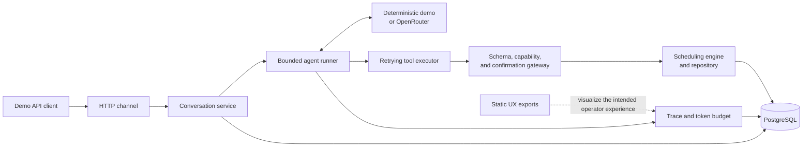

# Kontor

**An action-taking front desk that turns a customer conversation into a safely confirmed appointment.**

Service businesses lose bookings when a customer has to wait for opening hours, switch channels, or repeat the same details to several systems. A useful agent should do more than answer: it should find a real opening, ask before it changes anything, complete the booking, and leave an audit trail a person can inspect.

## A Thursday-evening haircut

Marta asks, “Can I get a haircut on Thursday evening?” Kontor checks the service catalogue, eligible staff, working hours, breaks, existing bookings, and time zones, then returns a real opening. When Marta chooses a time, Kontor shows the exact appointment and waits for an explicit confirmation before it writes the booking.

The wider business flow continues by updating the customer in the CRM and sending a reminder. Those two hand-offs are visible in the product designs below, but they are not implemented in the current runtime: today’s executable demo finishes with a persisted Kontor customer, a confirmed booking, and a trace of the agent run. This distinction is intentional—this README describes the code that exists, not the roadmap as if it had shipped.

## Screens


*Agent trace design — the conversation and every model/tool step share one timeline. The shown 2.94 s run, nested retry, CRM step, and confirmation sender are fixture data; the backend currently persists model calls, tool calls, nested attempts, token usage, and total run duration.*

<table>
  <tr>
    <td width="50%"></td>
    <td width="50%"></td>
  </tr>
  <tr>
    <td><em>Customer chat design — a human-readable confirmation sits between choosing a slot and creating the booking.</em></td>
    <td><em>Operator dashboard design — business outcomes and agent health in one view. The displayed 2.9 s median run latency is seeded fixture data, not a production benchmark.</em></td>
  </tr>
  <tr>
    <td colspan="2"></td>
  </tr>
  <tr>
    <td colspan="2"><em>Calendar design — bookings, breaks, time off, status changes, and conflicts are visible in the weekly operating view.</em></td>
  </tr>
</table>

The images are static exports from [`design/screens`](design/screens); the repository does not yet contain the browser application that makes them interactive.

## What it does

- Runs the haircut flow locally without an API key through a deterministic model substitute; OpenRouter is available as the real model adapter.
- Lists services and eligible staff, then calculates slots on a 15-minute grid across working hours, breaks, booking buffers, busy periods, and IANA time zones, including daylight-saving transitions.
- Requires a server-authorized, argument-bound confirmation before creating a booking. Slot offers expire after 5 minutes; confirmation proposals have a 10-minute ceiling and cannot outlive the slot offer.
- Rechecks availability inside a serializable transaction and uses both a per-staff/day lock and a PostgreSQL exclusion constraint to prevent double-booking.
- Makes booking requests idempotent, so a repeated client request returns the original booking instead of creating another one.
- Persists customers, conversations, messages, agent runs, model iterations, tool calls, retry attempts, bookings, and booking events in PostgreSQL.
- Exposes a small JSON demo API for creating a conversation, sending messages, and inspecting a run trace.
- Bounds each turn to 8 model iterations and 25 seconds by default. Retryable tool failures get at most 3 attempts, each with a 5-second timeout and capped exponential backoff.

## Quick start

You need Docker with Compose. The default Compose profile sets `DEMO_MODE=true` and `LLM_PROVIDER=fake`, so it does not need an LLM API key.

```sh
git clone https://github.com/reinh2/kontor.git
cd kontor
docker compose up --build
```

The service listens on `http://localhost:8080`; [the health endpoint](http://localhost:8080/healthz) returns JSON when startup is complete. Its Stage 1 endpoints are under `/api/v1/demo`, and `/readyz` exposes database readiness. To use a real model, copy [`.env.example`](.env.example), set `LLM_PROVIDER=openrouter`, `OPENROUTER_API_KEY`, and `OPENROUTER_MODEL`, then restart Compose.

## Architecture



The model can request actions, but it never owns identity, authorization, or the final scheduling decision. See [Engineering notes](docs/ENGINEERING.md) for the runtime path, persistence model, failure semantics, and test strategy.

## Design decisions

- **Propose, then act.** A mutating tool first returns an exact summary. A later, unambiguous customer message authorizes only those frozen arguments.
- **Keep authority outside the prompt.** Tenant, customer, conversation, inbound-message identity, and capabilities are resolved from persisted server state rather than model-authored JSON.
- **Make the database the final arbiter.** Signed slot tokens improve the hand-off, but the booking transaction still locks and rechecks the schedule before inserting.
- **Bound autonomy.** Iteration, time, output-token, conversation-token, and retry limits turn failure into a controlled escalation rather than an unbounded loop.
- **Record the parent action and its attempts.** One tool call stays readable in the trace even when the executor retries underneath it.

## Limitations

Kontor is a demonstration project, not a production booking service.

- It runs as one fixed demo tenant (`Salon Nord`); there is no authentication, tenant onboarding, or tenant-management UI.
- The HTTP surface is a JSON demo API. The web widget, Telegram channel, streaming updates, operator dashboard, trace viewer, and calendar shown above are designs, not wired application screens.
- Only `list_services`, `list_staff`, `find_slots`, and `create_booking` execute. Reschedule, cancellation, CRM contact/deal, and model-requested human-escalation contracts are allowlisted but return `NOT_IMPLEMENTED`; runtime failures can still create an escalation record.
- There is no HubSpot or CSV CRM adapter in this codebase yet, and no outbound email, SMS, or reminder sender. A customer row is stored in Kontor’s own database only.
- Calendar synchronization is currently a `noop`; PostgreSQL is the appointment source of truth for the demo.
- The `2.9 s` dashboard median is illustrative fixture data. The backend records individual run durations but does not yet aggregate operational metrics.
- The default secret and database credentials are demo values and must not be used outside a local environment.

## Licence

No licence file has been added to this repository. Until the owner chooses one, the source is not offered under an open-source licence and normal copyright restrictions apply.
