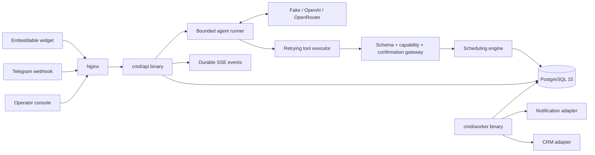

# Architecture

## System overview

Kontor is a Go monorepo producing two binaries (`cmd/api` and `cmd/worker`) backed by a single PostgreSQL 15 database. The API binary serves customer-facing channels (widget, Telegram, demo HTTP), an operator console SPA, and tenant onboarding endpoints. A bounded agent runner processes each customer turn using a deterministic fake LLM, OpenAI, or OpenRouter, proposing actions through a schema-validated tool gateway that enforces two-phase confirmation before any calendar mutation. The worker binary polls a durable job queue for post-booking side effects (reminders, CRM). Nginx sits in front as a reverse proxy for rate limiting passthrough and SSE buffering control.



## Technology stack

| Layer | Technology and version | Purpose | Source of truth |
|---|---|---|---|
| Language / runtime | Go 1.25 | Application logic | `go.mod` |
| Database driver | jackc/pgx/v5 v5.10.0 | PostgreSQL connection pool | `go.mod` |
| JSON Schema | santhosh-tekuri/jsonschema/v6 v6.0.2 | Tool argument validation | `go.mod` |
| Database | PostgreSQL 15 (Alpine) | Source of truth for all domain state | `compose.yaml` |
| Reverse proxy | nginx (unprivileged Alpine) | Edge routing, SSE proxy, body limits | `deploy/nginx/default.conf` |
| Containerization | Docker + Compose | Local/demo deployment | `Dockerfile`, `compose.yaml` |
| CI | GitHub Actions | Vet, test with race, Docker build, Compose smoke | `.github/workflows/ci.yml` |
| Frontend | Vanilla JS (widget), React DS bundle (operator) | Customer chat, operator console | `web/widget/`, `web/operator/` |

## Repository structure

```text
cmd/
  api/              HTTP server entry point
  worker/           Job processing entry point
internal/
  agent/            Bounded agent loop, budget, trace, tool interface
  agentbudget/      Per-conversation token budget (PostgreSQL)
  agenttools/       Retrying tool executor
  agenttrace/       Trace persistence
  app/              Conversation service (orchestrates agent + channels)
  bootstrap/        Runtime wiring and dependency injection
  channels/
    demohttp/       Demo API routes (conversation CRUD, messages, events, traces)
    onboardinghttp/ Tenant provisioning and operator management routes
    operatorhttp/   Operator console API (dashboard, runs, traces, calendar commands)
    telegram/       Telegram webhook handler
    tenanthttp/     Host-based tenant resolution middleware
  confirmations/    Two-phase confirmation storage and validation
  conversations/    Conversation state machine
  crm/              CRM interface + LogCRM + HubSpotCRM drivers
  demo/             Fixed-tenant seeding and demo catalog
  identity/         Operator authentication, sessions, password hashing, middleware
  jobqueue/         Durable job queue (claim, retry, dead-letter)
  llm/              LLM provider abstraction (fake + OpenAI + OpenRouter)
  notifications/    Notifier interface + LogNotifier driver
  platform/
    config/         Environment-based configuration loading
    database/       Connection pool, migration runner
    httpx/          CORS, rate limiter, response helpers
    ids/            UUID generation
    logging/        Structured slog setup
    metrics/        Prometheus registry and exposition endpoint
  scheduling/       Availability engine, booking repository, schedule locks
  tenants/          Tenant store, channel config, crypto
  tools/            Tool definitions and the schema/capability/confirmation gateway
db/migrations/      Forward-only SQL migrations (embedded via go:embed)
web/
  widget/           Customer chat widget (kontor.js, demo.html, embed.go)
  operator/         Operator SPA (index.html, DS bundle, embed.go)
design/             Design system, tokens, screen specimens
deploy/nginx/       Nginx configuration
```

| Path | Responsibility | May depend on |
|---|---|---|
| `internal/agent/` | Agent loop orchestration | `llm`, `agenttools`, `agenttrace`, `agentbudget` |
| `internal/app/` | Conversation service | `agent`, `confirmations`, `conversations`, `scheduling`, `jobqueue` |
| `internal/channels/*` | HTTP/webhook transport | `app`, `identity`, `tenants`, `platform/httpx` |
| `internal/scheduling/` | Availability + booking consistency | `platform/database` |
| `internal/tools/` | Tool gateway | `scheduling`, `confirmations` |
| `internal/platform/` | Cross-cutting infra | No internal domain dependencies |

## Component boundaries

### Agent runtime (`internal/agent/`)

- **Responsibility:** Execute a bounded turn: call the LLM, dispatch tool calls, enforce iteration/time/token budgets, produce traces.
- **Public interface:** `Runner.Run(ctx, turn) (Result, error)`
- **Owns:** Iteration state, budget accounting, trace events.
- **Must not:** Access the database directly or know about HTTP.

### Tool gateway (`internal/tools/`)

- **Responsibility:** Validate tool arguments against JSON Schema, enforce capability-scoped authorization, implement two-phase confirmation (propose → confirm).
- **Public interface:** Function dispatch table consumed by the agent runner.
- **Owns:** Tool definitions, argument schemas, confirmation lifecycle.
- **Must not:** Call the LLM or manage conversations.

### Scheduling engine (`internal/scheduling/`)

- **Responsibility:** Compute availability across services, staff, hours, breaks, buffers, and time zones; create/reschedule/cancel bookings with serializable transactions and schedule locks.
- **Public interface:** Repository methods for availability queries and booking mutations.
- **Owns:** Booking consistency (exclusion constraint, idempotency keys, version checks).
- **Must not:** Know about the agent, confirmations, or HTTP layer.

### Conversation service (`internal/app/`)

- **Responsibility:** Orchestrate a customer message from ingestion through agent execution to response and event persistence.
- **Public interface:** `Service.HandleMessage(ctx, input) (Response, error)`
- **Owns:** Conversation state transitions, event storage, escalation.
- **Must not:** Handle HTTP concerns or render responses.

### Identity (`internal/identity/`)

- **Responsibility:** Operator authentication (bcrypt passwords), session management (SHA-256 token digests), middleware extraction.
- **Public interface:** `Store.Login`, `Store.Validate`, `Middleware`.
- **Owns:** Operator and session rows, password hashing.
- **Must not:** Know about bookings, conversations, or the agent.

## Request and data flow

1. **Ingress:** Client request arrives at nginx, proxied to the API binary.
2. **Rate limiting:** In-memory token-bucket limiter (per client IP); health probes bypass.
3. **Tenant resolution:** Host-based or path-based tenant lookup (Stage 6 WIP).
4. **Authentication:** Customer capability token (SHA-256 digest match) or operator session token.
5. **Conversation service:** Loads conversation state, invokes the bounded agent runner.
6. **Agent turn:** LLM generates tool calls → executor retries each call through the gateway → gateway validates schema + authorization + confirmation state → scheduling engine executes.
7. **Confirmation:** If a mutation is proposed, it is stored; only a subsequent explicit customer confirm authorizes execution.
8. **Persistence:** Booking, events, trace, and outbox jobs committed in a single transaction.
9. **Response:** Turn result returned; SSE event written for streaming clients.
10. **Worker:** Polls `jobs` table, dispatches reminders and CRM upserts with bounded retries.

## Data model and persistence

- **Primary store:** PostgreSQL 15 (single instance).
- **Schema/migrations:** `db/migrations/000001..000006*.sql`, forward-only, checksum-guarded, applied at startup via `database.ApplyMigrations`.
- **Transactions/consistency:** Serializable isolation for booking mutations; `FOR UPDATE SKIP LOCKED` for job claims; exclusion constraint prevents overlapping bookings.
- **Caching:** None (all reads go to PostgreSQL).
- **Sensitive data:** Customer name, email, phone, message content; operator password hashes; capability token digests; Telegram bot token ciphertexts.
- **Retention/backups:** Not defined. No retention policy or backup runbook exists.

## APIs and integrations

| Interface | Direction | Authentication | Failure handling | Source |
|---|---|---|---|---|
| Demo conversation API | inbound | Bearer capability token (one-time, SHA-256 digest stored) | Agent escalation on failure | `internal/channels/demohttp/` |
| Operator API | inbound | Session bearer token (SHA-256 digest) | HTTP error responses | `internal/channels/operatorhttp/` |
| Onboarding API | inbound | Operator session | HTTP error responses | `internal/channels/onboardinghttp/` |
| Telegram webhook | inbound | Constant-time secret check | Per-update_id idempotency | `internal/channels/telegram/` |
| Widget SSE | outbound (streaming) | Capability token | Durable replay from Last-Event-ID | `internal/channels/demohttp/` |
| OpenAI / OpenRouter Chat Completions | outbound | Provider API key (env) | Bounded retries, dead-letter on provider failure | `internal/llm/` |
| HubSpot CRM API | outbound | API key (env, behind feature flag) | Job retry with exponential backoff | `internal/crm/` |

## Cross-cutting concerns

### Security

- LLM treated as untrusted planner; all mutations require server-side confirmation + authorization.
- Capability tokens: opaque, one-time issuance, only SHA-256 digest persisted.
- Operator sessions: bcrypt password hashing, SHA-256 session token digests, configurable TTL.
- Telegram webhook: constant-time secret verification.
- Tenant channel secrets: AES-GCM encryption at rest (bot tokens).
- CORS: configurable `HTTP_ALLOWED_ORIGIN` (defaults to `*` in demo; must be locked per-tenant for production).
- Rate limiting: per-IP token bucket at the HTTP edge.

### Error handling

- Agent: bounded iterations with escalation on exhaustion or repeated clarification.
- Tool executor: per-tool retry with backoff (max attempts configurable).
- LLM provider: dead-letter capture on persistent failure.
- Job queue: exponential backoff (30s base, 2^n, 1h cap), dead-letter after max attempts.
- HTTP: structured JSON error responses with no internal details leaked.

### Observability

- Structured `log/slog` logging (JSON in non-dev environments).
- `/healthz` (process alive) and `/readyz` (PostgreSQL reachable) probes.
- Persisted agent traces: iterations, tool calls, attempts, token usage, outcomes.
- Opt-in Prometheus metrics endpoint (`internal/platform/metrics/`); no distributed tracing or alerting configured.

### Configuration

- Environment variables loaded by `internal/platform/config/` at startup.
- `.env.example` documents all recognized variables.
- No config files or external config services.
- Validation: required variables fail startup; sensible defaults for optional values.

## Deployment and environments

| Environment | Purpose | Deployment method | Data/services |
|---|---|---|---|
| Local (Compose) | Development and demo | `docker compose up --build` | PostgreSQL 15, nginx, API, worker |
| CI (GitHub Actions) | Verification | Compose + service containers | Ephemeral PostgreSQL, Docker builds, smoke test |

- **CI/CD:** `.github/workflows/ci.yml` — vet, test with race detector, Docker builds, authenticated Compose smoke.
- **Rollback:** Not defined. Migrations are forward-only.
- **Health checks:** `/healthz` (liveness), `/readyz` (readiness including DB).

## Architectural invariants

- A booking is never created without prior explicit customer confirmation bound to the exact proposed facts.
- Every customer conversation action is authorized by a conversation-scoped capability token; model-supplied identity never controls a booking.
- Booking consistency is enforced at the database level: serializable transactions, schedule locks, exclusion constraints, idempotency keys.
- The agent has bounded iterations, execution time, retry attempts, and a persistent per-conversation token budget; exhaustion produces escalation, not an unbounded loop.
- Committed turns are stored before SSE delivery; reconnecting clients replay from `Last-Event-ID` without gaps.
- Post-booking side effects (reminders, CRM) are enqueued transactionally with the booking commit (outbox pattern).

## Known technical debt and risks

| Item | Impact | Evidence | Preferred next step |
|---|---|---|---|
| Single-instance rate limiter (in-memory) | Cannot scale horizontally | `internal/platform/httpx/` | Move to shared store (Redis or DB) |
| No live demo deployment | The widget, traces, and console cannot be evaluated without running Compose locally | README quick start is the only entry point | Deploy the demo with the fake adapter and link it from README |
| No down-migrations or restore runbook | Risky schema changes in production | `db/migrations/` forward-only | Document rollback procedure |
| CORS defaults to `*` | Insecure for production | `compose.yaml` env | Lock per-tenant origin before launch |
| No tracing/alerting | Limited production insight | Opt-in Prometheus `/metrics` exists (`internal/platform/metrics/`); no tracing/alerting | Add OpenTelemetry + alerting (Stage 7) |
| Operator console served without CSP | XSS risk in production | `web/operator/` embedded HTML | Add Content-Security-Policy header |

## Proposed architecture

Stage 6 (multi-tenancy and identity) is complete: `internal/identity/`, `internal/tenants/`, `internal/channels/onboardinghttp/`, `internal/channels/tenanthttp/`, and migration `000006`. See `ROADMAP.md` Stage 6 for the full scope.

Stage 7 (production hardening) is in progress: its first slice — the opt-in Prometheus `/metrics` endpoint (`internal/platform/metrics/`), secrets hardening, and CI vulnerability/SAST scanning — has landed; the remaining scope (shared-store rate limiting, tracing/alerting, external calendar sync, rollback/restore runbook) is open. See `ROADMAP.md` Stage 7.
